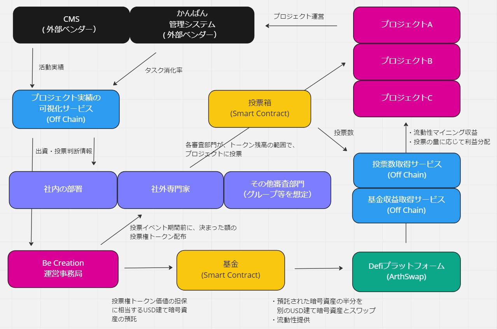

## What's our challenges?
> 課題は何だろう？

### Management Layers
 - どのプロジェクトに、いくら出資すべきか
     - プロジェクトがどんな活動をしているかが見えない
	 - プロジェクトの実績がないと、出資判断は難しい
- どのタイミングで出口判断をすべきか
   
### Project Leaders 
- プロジェクト起案前フェーズにも、多くの資金・マンパワーが必要
   - どんなに良いアイディアも、実績がないと土俵にさえ立てない
   - 資金・マンパワーと実績 ≒ ニワトリとタマゴ の状態

## What's the solutions? 
> どんな仕組みがあるとうれしいだろう？

### For Management Layers
- プロジェクトの実績が見える化される仕組み
- DAO の考え方を用いて、社内外の審査機関が、プロジェクトへの投票に参加し、間接的に出資判断を行う仕組み
  - 最終的な出資の専決権は残るものの、Be Creation 事務局の主な仕事が、予算や Web3 ウォレットの管理のみに集約されていくことを期待します。

### For Project Leaders
- Defi の機構を使って、プロジェクト立ち上げ段階の資金を融通し、支援を行う仕組み

## How it works?
> 仕組みを動かすための具体的な方法
 

### Step1 
- Be Creation 事務局は、社内の部署、社外専門家を含めた、各審査部門へ投票トークンを配布します。（ 以下、審査部門を「トークンホルダー」と呼びます）
 -  Be Creation 事務局は、トークン価値の担保資産として、トークン発行量と同一数量の USドル建て暗号資産を基金にプールしておきます。これにより、1トークンあたり１USドルという価格基準が発生します。
    -  トークン配布対象の粒度について、ここでは各部署単位としていますが、現状に合わせて調整可能です。
    - トークンはプロジェクトの投票イベント期間前に、トークンホルダーへ定期的に配分されます

### Step2
- 事務局はトークンホルダーに対し、投票イベント期間開始のアナウンスをします。
- トークンホルダーは、興味を惹かれるプロジェクトに対し、自分のトークン残高の範囲で自由に投票します。
- １トークンホルダーあたり１票ずつ、という投票方式ではなく、あるプロジェクトに対し、USドル基準でいくらまでなら出資したいか、という投票の仕方をします。

### Step3
- プロジェクトは、プロジェクトに投票された額を原資とみなした Defi 利回り相当額を、活動資金として受け取りながら、活動実績を蓄積していきます 。

### Step4
- 事務局は、プロジェクトの活動実績、タスク消化率やプロジェクトに投票された金額を見ながら、出資可否の判断、出資金額の査定を行います。

## Unique value proposition

> 独自の価値提供

### Long Tail
- 伸びしろがある、駆け出しのプロジェクトへの可能性を与え、プロジェクト起案者のモチベーション向上につなげます。
	- とりあえずやってみたら？ができる環境に 

### Friendly with Web3
- Defi / DAO など、Web3 の主要な仕組み、概念を積極的に取り入れています。
	- 基金の運用 → Defiプラットフォーム ArthSwap を用いた流動性マイニング
	- プロジェクトへの投票・供託・出資の仕組み → DAOの概念

### Zero Config
 - プロジェクト側は Web3 ウォレットや暗号資産を直接持つ必要がありません。
 - 報酬の計算と引き出しは、バッチ処理によって記録実行され、プロジェクトへの報酬付与は、事務局から法定通貨の送金によって行われます。

### Integration
   - 様々なプロジェクトの横断的な可視化ができます。
   - プロジェクト毎に様々な管理ツールを使っていることが想定されるため、外部ベンダーサービスとの統合を想定した作りになっています。   
       - デモの例
          - 活動実績の記録 MicroCMS 
          - タスクの管理 Jira
       - 持続可能な事業にすることができれば、対応範囲を拡大していきます。