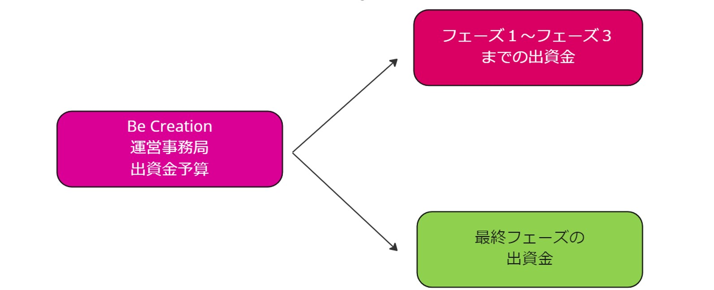
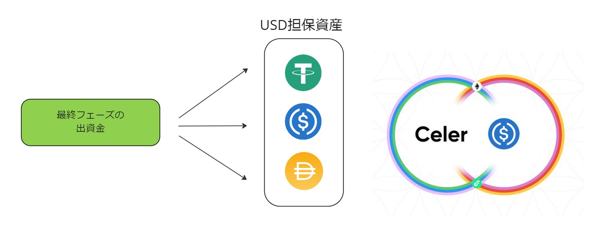
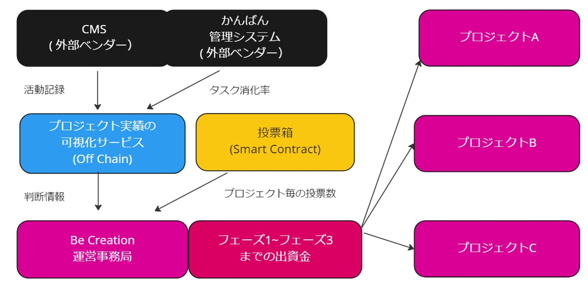
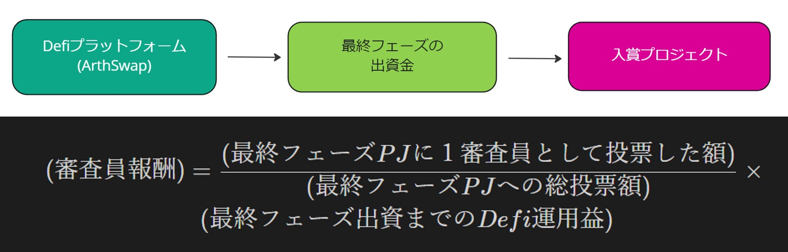

# ビジネスアイディア

[READMEへ戻る](../README.md)

## 前提条件 

Be Creation の審査の枠組みを以下のように定義します。

> 簡単なヒアリング内容に基づいているため、現実との齟齬については調整予定です。

---

## Step1 

まず、出資金を最終フェーズ分の予算とそれ以外の２つに色分けします。

 

## Step2 

最終フェーズ出資金を USドル担保 の Stable Coin に換金します。

> デモでは、Celer USDC という Stable Coin を使用しています。
>
> 実際には価格インパクトや流動性プールのアンバランスを防ぐために、複数の通貨に分散することが必要と考えられます。

 

## Step3

Stable Coin を基金 Smart Contract (Fund) を通して Defiプラットフォーム に預けて運用します。

> デモでは、Step3 までを、初期化スクリプトで行っています。

 

## Step4

Defiプラットフォームに預け入れた Stable Coin と同額の投票権トークンを発行し、
審査フェーズ前に、各審査員に配布（エアドロップ）します。

> （100 USドルという数字は仮です）
>
> 投票権トークンの供給量を 預託した Stable Coin と同じ発行量としている理由については以下のとおりです。
> 
> - 投票者が、自分が出資者だったらいくらプロジェクトに出資したいかを、金額でイメージしやすくするため
> - 現在、どれだけの資産を運用しており、その内、審査員としてどれだけのシェアを持っているのかというイメージを持ちやすくするため

 

## Step5

審査フェーズに入ったら、各審査員が、手持ちのトークンを消費し、Smart Contract (Ballot) を通してプロジェクトに投票します。

> 投票に使われたトークンは、投票と同時に Smart Contract 上で事務局に返却され、次の審査フェーズ前に再配布されます。

 

## Step6

直近の投票数やタスク消化率、活動実績を集計し画面上に表示します。事務局はそれらの情報を元に、どのプロジェクトを次フェーズに進めるか決定します。

> デモでは、 CMS として [MicroCMS](https://microcms.io/)、 かんばん管理システムとして [Jira](https://www.atlassian.com/ja/software/jira) を用いています。

 

## Step7

最終フェーズ出資金をDefiから引き揚げ、最終審査通過プロジェクトに配分すると同時に、最終審査通過プロジェクトへの投票金額、Defi運用益額等を元に、審査員への報酬を計算します。

 

## Step8

事務局は、収益確定・記録サービスに報酬確定キューを出し、審査員となってくれたプロジェクトに対して予算を配分します。

---

**具体的なデモ・ユースケースについてはこちら↓**

**[デモ動画・ユースケース一覧](./UseCases.md)**

---

[READMEへ戻る](../README.md)
